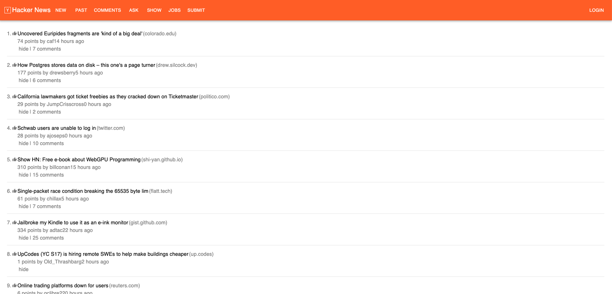

# Hacker News Reader

## Overview

This project is a web application that fetches and displays stories from Hacker News API. It is built using React and utilizes the React Query library for efficient data fetching and caching. This README provides an overview of the architecture and design principles followed in the application.

## Readable and DRY Code

- Modular Structure: The application is divided into clear, logical modules (components, hooks, and services). Each module has a specific responsibility, making it easier to understand and maintain the codebase.
- Custom Hooks are used such as `useFetchStories` to encapsulate data-fetching logic. This approach keeps components clean and focused solely on rendering the UI, promoting the DRY (Don't Repeat Yourself) principle.

## Clean, Easy-to-Use UI

- Material-UI is used to create a modern and consistent look. The interface is simple and user-friendly.
  
- Responsive Design: The layout works well on all devices, from phones to desktops.
  
- User Feedback: Loading states, such as the CircularProgress spinner, and error messages are integrated into the UI to provide users with clear feedback during interactions.
  

---


---


## Best Practices in React

- Component-Based Architecture: The application is structured around reusable React components, promoting modularity and separation of concerns. Each component is responsible for its own rendering logic and state management, which enhances maintainability.
- React Query: The application uses React Query for data fetching, which simplifies the state management of server state and provides built-in caching, synchronization, and error handling.
- Context API: The use of the Context API (via ApiProvider) allows us to manage and provide API services throughout the component tree efficiently. This avoids prop drilling and keeps the code clean.

## Test Coverage

- Unit Testing: Jest and React Testing Library are utilized to test components and hooks.
  
- Coverage Reports: Istanbul with Jest is used to generate coverage reports. High test coverage is targeted to identify parts of the code that require more testing. These reports help ensure the app remains reliable by confirming that important features function correctly.
  

## Getting Started

To run this project, you'll need to have Node.js installed on your machine. This project uses Vite for development and build tooling.

### Prerequisites

Make sure you have the following installed:

- Node.js (version 14 or later)
- npm (comes with Node.js)

### Installation

1. Clone the repository:

```
git clone https://github.com/iqbal86/hacker-news-app.git
cd hacker-news-app
```

2. Install dependencies:

```
npm install
```

### Running the Project

You can run the project in development mode or build it for production. Here are the commands you need:

- Development mode: This will start the Vite development server.

```
npm run dev
```

After running this command, open your browser and navigate to http://localhost:3000 (or whatever port Vite specifies) to view the app.

### Linting

To run lint:

```
npm run lint
```

### Testing

To run the tests, execute:

```
npm run test
```

You can also run tests with coverage:

```
npm run coverage
```

## Assumptions Made During Development

- API Reliability: It is assumed that the Hacker News API will remain stable and accessible, ensuring consistent data fetching for the application.
- Data Consistency: The format and structure of data returned from the Hacker News API are expected to remain consistent, minimizing the need for frequent updates to data handling.
- Performance Expectations: Users are anticipated to expect a fast and responsive interface, informing the design of caching strategies and loading indicators for optimal user experience.
